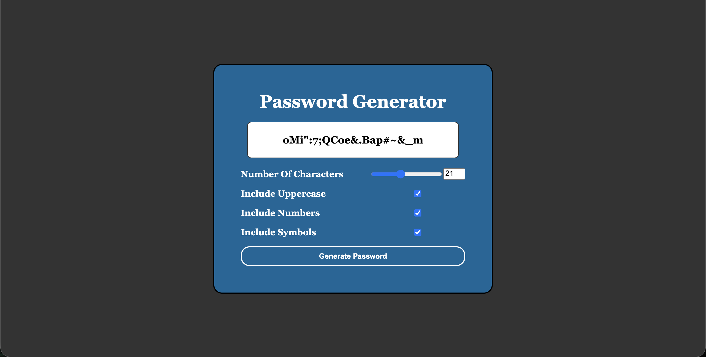

# Project Name  
Generate Password
---

## Table of Contents

- [About the Project](#about-the-project)
- [Project Overview](#project-overview)
- [Key Features](#key-features)
- [Tech Stack](#tech-stack)
- [Dependencies](#dependencies)
- [Installation️ & Setup](#installation--setup)
- [Folder Structure](#folder-structure)
- [Contributions](#contributions)
- [How to Contribute](#how-to-contribute)
- [License](#license)
- [Contact](#contact)

---

## About the Project 
The website can help you to create a very fast, strong, secure password.
Note: This project is created with the help of AI.

---

## Project Overview  
- Occasionally we need to create or think of a password in a hurry. This website helps you to create or think of a password quickly to save your time.



---

## Key Features  
- Generate Password
- Pick your combination
- Copy 

---

## Tech Stack  
**Frontend:** HTML · CSS · JS
**Backend:** -
**Tools:** VS Code · GitHub

---

## Dependencies  

-

---

## Installation️ & Setup
1. Clone the repo and install dependencies:

```bash
git clone https://github.com/abdurrahman0205/A-01
```

2. Open index.html to view the website.

---

## Folder Structure

```plaintext
GeneratePassword/
├── index.html
├── style.css
├── assets/
│   ├── components/
│   ├── images/

├── public/

```

---

## How to Contribute (Optional)

  - Fork the Project
  - Create a branch (`git checkout -b feature/AmazingFeature`)
  - Commit changes (`git commit -m 'Add some AmazingFeature'`)
  - Push the branch (`git push origin feature/AmazingFeature`)
  - Open a Pull Request

---

## License (Optional)
Distributed under the MIT License. See `LICENSE.txt` for more information.

---

## Contact

**Live URL:** [Live Site](https://abdurrahman0205.github.io/GeneratePassword/)
**Email:** [username](dev.abdurrahman0205@gmail.com)
